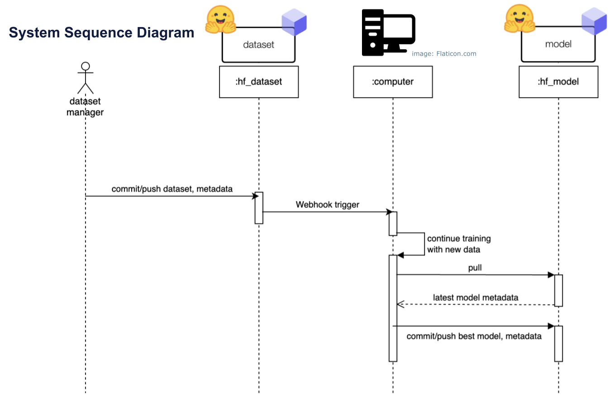

# esgBERT_MLOps

## Description

`hf_dataset`: dataset repository hosted on Hugging Face Hub. (current: [owen198/esgBERT_dataset](https://huggingface.co/datasets/owen198/esgBERT_dataset))  \
`hf_model`: model repository hosted on Hugging Face Hub.(current: [owen198/esgBERT_CICD](https://huggingface.co/owen198/esgBERT_CICD)) 

`esgBERTv4.py`: training script \
`train_used.csv`: all used training data \
`webhook.py`: flask server to receive webhook trigger \
`metric_logs`: directory to store each run's metrics \
`log.txt`: log of the training process

## Instructions

### Requirements
* Git, Git LFS
* Python packages (to add)
### Setup
1. Clone the model and dataset repo and set up the git credential.
2. Make sure that the working directory, file names are set correctly.
3. Setup the webhook flask server: `python webhook.py`
4. Set the webhook in Hugging Face: "Settings->Webhooks". It should be triggered by the `hf_dataset` repository's main branch commit.

### Flow
1. New dataset committed and pushed to `hf_dataset`.
2. Triggered webhook, training script started.
3. Train on unseen data, starting from the previous model. 
4. If the new model has better metrics: \
    a. Log model metric. \
    b. Commit and push new model and metric to the `hf_model` repository. \
    c. Update `train_used.csv`
5. If the new model DOESN'T have better metrics: do nothing

### Tips 
* make sure to create `metric_logs` folder to store metric logs and avoid error.
* Make sure to run the webhook server in the background. 
* Using ngrok is an option for testing.

## TODOs
- [ ] Add `requirements.txt` for python pakages
- [ ] Replace flask server with Jenkins

